# Core Lending Mortgages Microservice

[](https://opensource.org/licenses/Apache-2.0)
[](https://openjdk.java.net/projects/jdk/21/)
[](https://spring.io/projects/spring-boot)

## Overview

The **Core Lending Mortgages Microservice** is a critical component of the **Firefly OpenCore Banking Platform**, developed by **Firefly Software Solutions Inc** under the Apache 2.0 license. This microservice provides comprehensive mortgage management capabilities, handling the complete lifecycle from application submission to contract management, payment processing, and regulatory compliance.

As part of the Firefly OpenCore ecosystem, this service delivers enterprise-grade mortgage processing capabilities with reactive architecture, ensuring high performance and scalability for financial institutions.

**Organization**: [firefly-oss](https://github.com/firefly-oss)  
**Website**: [getfirefly.io](https://getfirefly.io)  
**License**: Apache 2.0

## Features

- **Mortgage Application Management**: Complete application lifecycle with status tracking
- **Property Management**: Comprehensive property information and appraisal handling
- **Contract Management**: Mortgage contract creation, modification, and tracking
- **Payment Processing**: Payment schedules, records, and automated calculations
- **Insurance Management**: Mortgage insurance policies and coverage tracking
- **Disbursement Control**: Loan disbursement management and tracking
- **Notification System**: Automated alerts and notifications
- **Reactive Architecture**: Built with Spring WebFlux for high-performance processing
- **RESTful API**: Comprehensive REST API with OpenAPI documentation

## Architecture

### Module Structure

The microservice follows a modular architecture with clear separation of concerns:

```
core-lending-mortgages/
├── core-lending-mortgages-core/      # Business logic and service implementations
├── core-lending-mortgages-interfaces/ # DTOs, enums, and interface contracts
├── core-lending-mortgages-models/     # JPA entities and database repositories
├── core-lending-mortgages-web/       # REST controllers and web configuration
└── core-lending-mortgages-sdk/       # Client SDK and OpenAPI specifications
```

### Technology Stack

- **Java 21**: Latest LTS version with virtual threads support
- **Spring Boot 3.x**: Application framework with reactive capabilities
- **Spring WebFlux**: Reactive web framework for non-blocking I/O
- **Spring Data R2DBC**: Reactive database connectivity
- **PostgreSQL**: Primary database with R2DBC driver
- **Flyway**: Database migration management
- **Maven**: Build and dependency management
- **Docker**: Containerization and deployment
- **OpenAPI 3**: API documentation and specification
- **Lombok**: Boilerplate code reduction

## Entity Relationship Diagram

The following diagram illustrates the complete data model and relationships between entities:

```mermaid
erDiagram
    MORTGAGE_APPLICATION {
        UUID mortgage_application_id PK
        UUID applicant_id FK "External Customer reference"
        UUID co_applicant_id FK "Optional co-applicant"
        UUID property_id FK
        UUID product_id FK "External Product reference"
        application_status application_status
        application_channel application_channel
        decimal requested_amount
        int requested_term_months
        decimal down_payment
        decimal monthly_income
        decimal monthly_expenses
        employment_type employment_type
        residence_type residence_type
        int years_at_current_job
        int years_at_current_address
        purpose purpose
        boolean existing_customer
        text remarks
        varchar assigned_to
        timestamp submission_date
        timestamp created_at
        timestamp updated_at
    }

    MORTGAGE_PROPERTY {
        UUID property_id PK
        property_type property_type
        property_status property_status
        property_use property_use
        varchar address_line1
        varchar address_line2
        varchar city
        varchar state
        varchar postal_code
        varchar country_code
        decimal land_area
        decimal built_area
        int construction_year
        int renovation_year
        varchar title_number
        varchar cadastral_reference
        text legal_description
        int total_rooms
        int total_bedrooms
        int total_bathrooms
        boolean has_parking
        int parking_spaces
        boolean has_storage
        decimal storage_area
        boolean has_elevator
        int floor_number
        energy_rating energy_rating
        text restrictions
        timestamp created_at
        timestamp updated_at
    }

    MORTGAGE_APPRAISAL {
        UUID appraisal_id PK
        UUID property_id FK
        UUID mortgage_application_id FK
        varchar appraiser_name
        varchar license_number
        appraisal_type appraisal_type
        decimal market_value
        decimal rental_value
        decimal replacement_cost
        decimal land_value
        decimal building_value
        property_condition property_condition
        location_rating location_rating
        text comparable_properties "JSON array"
        date appraisal_date
        date expiry_date
        boolean requires_repairs
        text required_repairs
        decimal repair_cost
        text assumptions
        text limitations
        text methodology
        text comments
        timestamp created_at
        timestamp updated_at
    }

    MORTGAGE_CONTRACT {
        UUID mortgage_contract_id PK
        UUID mortgage_application_id FK
        UUID property_id FK
        varchar contract_number
        contract_status contract_status
        decimal loan_amount
        decimal interest_rate
        rate_type rate_type
        varchar reference_rate
        decimal margin_rate
        int term_months
        date start_date
        date maturity_date
        decimal monthly_payment
        decimal early_repayment_fee
        boolean assumable
        decimal tax_rate
        text special_conditions "JSON format"
        varchar notary_reference
        timestamp signing_date
        timestamp created_at
        timestamp updated_at
    }

    MORTGAGE_INSURANCE {
        UUID insurance_id PK
        UUID mortgage_contract_id FK
        insurance_type insurance_type
        varchar policy_number
        varchar provider_name
        varchar provider_code
        decimal coverage_amount
        decimal deductible_amount
        date start_date
        date end_date
        decimal annual_premium
        premium_frequency premium_frequency
        decimal premium_amount
        boolean bank_beneficiary
        boolean is_active
        date last_payment_date
        date next_payment_date
        text coverage_details "JSON format"
        timestamp created_at
        timestamp updated_at
    }

    MORTGAGE_DISBURSEMENT {
        UUID disbursement_id PK
        UUID mortgage_contract_id FK
        decimal disbursement_amount
        date disbursement_date
        timestamp created_at
        timestamp updated_at
    }

    MORTGAGE_PAYMENT_SCHEDULE {
        UUID schedule_id PK
        UUID mortgage_contract_id FK
        int installment_number
        date due_date
        decimal principal_amount
        decimal interest_amount
        decimal fee_amount
        decimal escrow_amount
        decimal total_amount
        payment_status payment_status
        date paid_date
        decimal outstanding_balance
        decimal late_fee_amount
        int days_late
        text payment_breakdown "JSON detail"
        timestamp created_at
        timestamp updated_at
    }

    MORTGAGE_PAYMENT_RECORD {
        UUID payment_record_id PK
        UUID mortgage_contract_id FK
        UUID payment_schedule_id FK "Optional link"
        UUID transaction_id FK "External Payment reference"
        decimal payment_amount
        date payment_date
        boolean is_partial_payment
        text note
        timestamp created_at
        timestamp updated_at
    }

    MORTGAGE_NOTIFICATION {
        UUID notification_id PK
        UUID mortgage_contract_id FK
        notification_type notification_type
        priority priority
        varchar recipient
        text message
        boolean is_sent
        timestamp sent_at
        timestamp created_at
    }

    %% Relationships
    MORTGAGE_APPLICATION ||--|| MORTGAGE_PROPERTY : "references"
    MORTGAGE_APPLICATION ||--o{ MORTGAGE_APPRAISAL : "has"
    MORTGAGE_APPLICATION ||--o| MORTGAGE_CONTRACT : "generates"
    MORTGAGE_PROPERTY ||--o{ MORTGAGE_APPRAISAL : "appraised_by"
    MORTGAGE_PROPERTY ||--o{ MORTGAGE_CONTRACT : "secures"
    MORTGAGE_CONTRACT ||--o{ MORTGAGE_INSURANCE : "protected_by"
    MORTGAGE_CONTRACT ||--o{ MORTGAGE_DISBURSEMENT : "funded_by"
    MORTGAGE_CONTRACT ||--o{ MORTGAGE_PAYMENT_SCHEDULE : "scheduled_in"
    MORTGAGE_CONTRACT ||--o{ MORTGAGE_PAYMENT_RECORD : "paid_through"
    MORTGAGE_CONTRACT ||--o{ MORTGAGE_NOTIFICATION : "notified_via"
    MORTGAGE_PAYMENT_SCHEDULE ||--o{ MORTGAGE_PAYMENT_RECORD : "fulfilled_by"
```



## API Endpoints

The microservice provides RESTful APIs for all major entities:

### Mortgage Applications
- `GET /api/v1/mortgage-applications` - List applications with filtering
- `POST /api/v1/mortgage-applications` - Create new application
- `GET /api/v1/mortgage-applications/{id}` - Get application by ID
- `PUT /api/v1/mortgage-applications/{id}` - Update application
- `DELETE /api/v1/mortgage-applications/{id}` - Delete application

### Mortgage Properties
- `GET /api/v1/mortgage-properties` - List properties
- `POST /api/v1/mortgage-properties` - Create property
- `GET /api/v1/mortgage-properties/{id}` - Get property details
- `PUT /api/v1/mortgage-properties/{id}` - Update property
- `DELETE /api/v1/mortgage-properties/{id}` - Delete property

### Mortgage Contracts
- `GET /api/v1/mortgage-contracts` - List contracts
- `POST /api/v1/mortgage-contracts` - Create contract
- `GET /api/v1/mortgage-contracts/{id}` - Get contract details
- `PUT /api/v1/mortgage-contracts/{id}` - Update contract
- `DELETE /api/v1/mortgage-contracts/{id}` - Delete contract

### Payment Management
- `GET /api/v1/mortgage-contracts/{contractId}/payment-schedules` - Get payment schedules
- `POST /api/v1/mortgage-contracts/{contractId}/payment-schedules` - Create schedule
- `GET /api/v1/mortgage-contracts/{contractId}/payment-records` - Get payment records
- `POST /api/v1/mortgage-contracts/{contractId}/payment-records` - Record payment

### Insurance Management
- `GET /api/v1/mortgage-contracts/{contractId}/insurance` - List insurance policies
- `POST /api/v1/mortgage-contracts/{contractId}/insurance` - Add insurance
- `PUT /api/v1/mortgage-contracts/{contractId}/insurance/{id}` - Update insurance

### Notifications
- `GET /api/v1/mortgage-contracts/{contractId}/notifications` - List notifications
- `POST /api/v1/mortgage-contracts/{contractId}/notifications` - Create notification

## Setup and Installation

### Prerequisites
- Java 21 or higher
- Maven 3.8+
- PostgreSQL 13+
- Docker (optional, for containerization)

### Environment Variables
```bash
# Database Configuration
DB_HOST=localhost
DB_PORT=5432
DB_NAME=mortgage_db
DB_USERNAME=mortgage_user
DB_PASSWORD=mortgage_password
DB_SSL_MODE=disable

# Server Configuration
SERVER_ADDRESS=localhost
SERVER_PORT=8080
```

### Building the Application
```bash
# Clone the repository
git clone https://github.com/firefly-oss/core-lending-mortgage.git
cd core-lending-mortgage

# Build the application
mvn clean install

# Run tests
mvn test
```

### Running the Application
```bash
# Run with Maven
mvn spring-boot:run -pl core-lending-mortgages-web

# Or run the JAR directly
java -jar core-lending-mortgages-web/target/core-lending-mortgages-web-1.0.0-SNAPSHOT.jar
```

### Docker Deployment
```bash
# Build Docker image
docker build -t firefly/core-lending-mortgages .

# Run with Docker Compose
docker-compose up -d
```

## API Documentation

Once the application is running, you can access:

- **Swagger UI**: http://localhost:8080/swagger-ui.html
- **OpenAPI Spec**: http://localhost:8080/v3/api-docs
- **Health Check**: http://localhost:8080/actuator/health

## Contributing

We welcome contributions to the Firefly OpenCore Banking Platform! Please follow these guidelines:

1. **Fork** the repository
2. **Create** a feature branch (`git checkout -b feature/amazing-feature`)
3. **Commit** your changes (`git commit -m 'Add amazing feature'`)
4. **Push** to the branch (`git push origin feature/amazing-feature`)
5. **Open** a Pull Request

### Development Standards
- Follow Java coding conventions
- Write comprehensive unit tests
- Document public APIs with JavaDoc
- Use meaningful commit messages
- Ensure all tests pass before submitting PR

## License

This project is licensed under the Apache License 2.0 - see the [LICENSE](LICENSE) file for details.

## Support

For support and questions:
- **Website**: [getfirefly.io](https://getfirefly.io)
- **GitHub Issues**: [Create an issue](https://github.com/firefly-oss/core-lending-mortgage/issues)
- **Email**: dev@getfirefly.io

---

**Firefly Software Solutions Inc** - Building the future of open banking technology.
